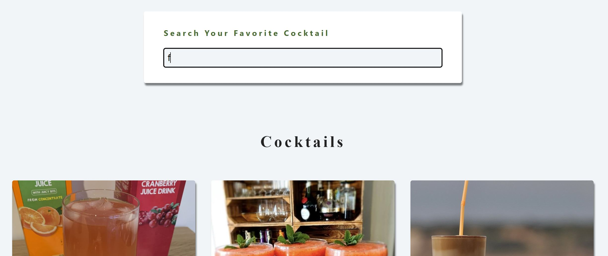

# Search Your Favorite Cocktail

A web-app for dynamically retrieved cocktails list [Live Link](https://jeffdeng-project-cocktail.netlify.app/)

## Description

This app is built with React.

The purpose of this project is to practice and enhance my front-end development skills, especially React framework such as React Router.

## Relevant Techs

### Front-End:

- React
- Sass
- Context API and React Router

## Key Features

- Dynamic retrieve
  
- SPA(error page and cocktail detail page)
  ```
      <Routes>
        <Route path="/" element={<Home />} />
        <Route path="/about" element={<About />} />
        <Route path="/cocktail/:id" element={<SingleCocktail />} />
        <Route path="*" element={<Error />} />
      </Routes>
  ```

## Challenges

- The most difficult part is the dynamic search feature which is achieved by dynamically updating search term, which will trigger the useEffect hook to call the cocktailDB API
